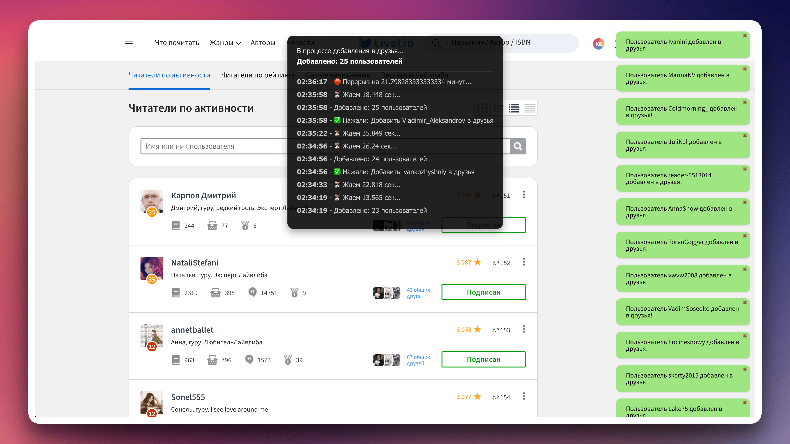

# **Libmatic**

**Libmatic** — умный браузерный скрипт для автоматизации действий на **LiveLib**. Он автоматически добавляет друзей и ставит лайки, избавляя от рутинных задач и экономя ваше время. ⏳✨

## ⚙️ Функции
- **Авто-добавление в друзья** – автоматически добавляет пользователей в друзья. 🤝
- **Авто-лайки** – автоматически ставит лайки на рецензии, цитаты, истории и лайфхаки. ❤️

## **Объяснение скриптов**

1. **AutoLike.js** ❤️:
   - Этот скрипт автоматически ставит лайки на различные элементы платформы LiveLib, такие как рецензии, цитаты, истории и лайфхаки.
   - **Зачем это нужно?** С помощью этого скрипта вы можете быстро и эффективно взаимодействовать с контентом на платформе, не тратя время на ручной процесс ставить лайки.

2. **AutoFriend.js** 🤝:
   - Скрипт автоматически добавляет пользователей в друзья. Он находит активных пользователей и отправляет запросы на добавление в друзья.
   - **Зачем это нужно?** Это позволяет вам быстро расширять свою сеть контактов на LiveLib, не тратя время на поиск новых людей для добавления в друзья.

3. **AutoFriendReviews.js** 📚🤝:
   - Этот скрипт добавляет пользователей в друзья, исходя из их активности в ленте рецензий. Он автоматически отправляет запросы на добавление в друзья тем, кто оставляет рецензии на книги.
   - **Зачем это нужно?** Это полезно для расширения круга общения с пользователями, которые активно оценивают книги, что может привести к интересным обменам мнениями и рекомендациями.

## 🔧 Установка
1. **Установите Tampermonkey**
 - Перейдите на [Tampermonkey.net](https://tampermonkey.net/) и добавьте расширение в браузер. 🌐
2. **Добавьте скрипты**
 - Откройте Tampermonkey → нажмите «Создать новый скрипт». ✏️
 - **AutoLike.js** – вставьте код из [`AutoLike.js`](AutoLike.js), сохраните. 💾
 - **AutoFriend.js** – создайте второй скрипт, вставьте код из [`AutoFriend.js`](AutoFriend.js), сохраните. 💾
 - **AutoFriendReviews.js** – создайте третий скрипт, вставьте код из [`AutoFriendReviews.js`](AutoFriendReviews.js), сохраните. 💾
3. **Включите скрипты**
 - Перейдите в Tampermonkey и убедитесь, что скрипты **активны**. ✅

🚀 Готово! Скрипты работают автоматически!

## Где получить помощь
Если у вас возникли вопросы или проблемы, обращайтесь в раздел **[issues](https://github.com/DevCicadaY/Libmatic/issues)**.
